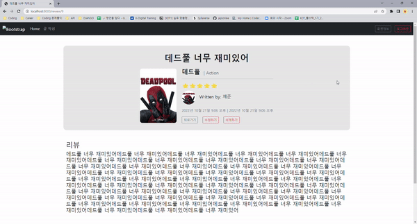

# 🧑‍💻 Django Pair Project 20221021

#### Who? 

> 이제준, 김지연, 김현중

#### Used Tool?

> Python, Django, HTML, CSS

#### What?

> 지금까지 배운 내용을 토대로 영화 리뷰 웹 서비스를 구현했다
>
> 구현한 기능
>
> - `Review` CRUD (Create, Read, Update, Delete)
> - `Comment` Create, Read, Delete
> - `Accounts` Create, Read, Delete
> - 1:N 기능

##### 1:N 기능

- Review -> User
  - 어떤 유저가, 해당 리뷰를 썼는지
- Comment -> User & Review
  - 어떤 유저가, 어떤 리뷰에 댓글을 작성했는지

#### 회원가입

> 회원가입 완료 후, 바로 로그인이 자동으로 되며, 홈페이지로 이동을 한다

#### 로그인

#### 로그인 후 댓글 작성 페이지

> 리뷰 작성 페이지, 리뷰 페이지, 댓글기능 등은 모두 로그인을 해야 들어갈 수 있다
>
> 즉 해당 페이지를 들어가려면, 로그인을 해야하고, `request.GET.get('next')`를 통해, 로그인 후 처음에 클릭했던 페이지로 바로 들어갈 수 있도록 만들었다

#### 리뷰 페이지 만들기

#### 댓글 쓰기

#### 프로필 페이지

